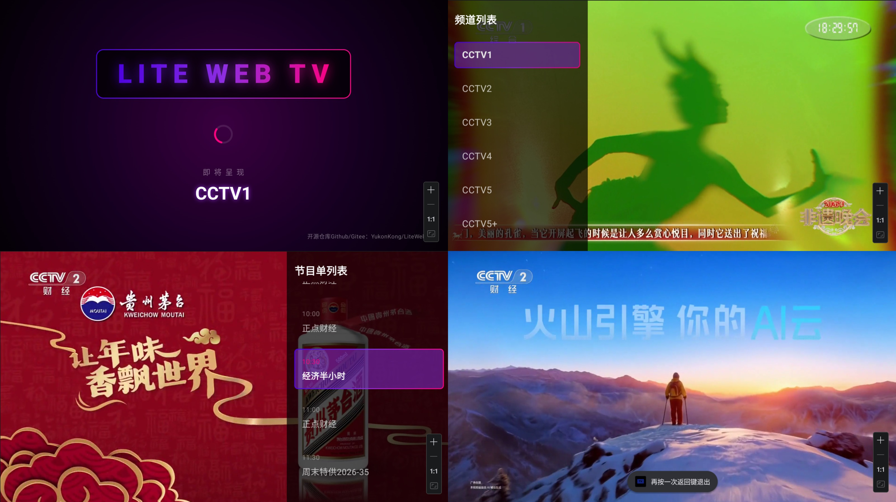

<h1>📺 LiteWebTV v2.0</h1>

<b>一个极具现代感、极客风与极限性能的 Android TV 直播客户端</b>

基于 Jetpack Compose for TV 构建 | 霓虹磨砂主题 | 秒级无缝热切台

## ✨ 项目简介

LiteWebTV 颠覆了传统的电视直播 App 开发模式。它通过“降维打击”的方式，将庞大复杂的现代化 Web 单页应用（SPA）封装在极简的 WebView 引擎中。通过**网络层物理断流**、**DOM 节点刺客脚本注入**以及**纯净 UI 接管**，将网页中的永久免费频道提纯，为您带来极其纯粹、丝滑的沉浸式大屏观影体验。

## 🚀 核心特性

* ⚡️ **秒级热切台 (Zero-Reload)**：告别切台黑屏！利用 Web SPA 路由劫持技术，切台不刷新网页，直接替换底层 HLS 视频流。
* 🎨 **主机级 UI 表现**：采用 Jetpack Compose 全新构建。丝滑的流光升降幕布、深邃的暗黑磨砂侧边栏、全局紫红霓虹焦点光效。
* 🤖 **自动化提权引擎**：内置 JS 刺客脚本，自动剔除收费/限免频道，自动寻路切换至 **1080P 蓝光画质**，自动接管静音控制。
* 🎮 **完美遥控器映射**：深度定制的 TV D-Pad 焦点路由，告别反人类的鼠标模拟，提供纯正的电视交互手感。
* 📺 **智能 OSD 与节目单**：切台即刻浮现当前节目悬浮窗（OSD），实时抓取并生成带有时间轴的右侧沉浸式节目单。

## 🕹️ 遥控器操作指南

| 物理按键 | 触发行为 | 逻辑说明 |
| --- | --- | --- |
| **⬆️ 向上键** | **快捷切台** | 切换至上一个频道。伴随加载幕布丝滑起降。 |
| **⬇️ 向下键** | **快捷切台** | 切换至下一个频道。带有频率防抖限制。 |
| **⬅️ 向左键** | **频道列表** | 从屏幕左侧划出深色磨砂频道侧边栏。再次按下关闭。 |
| **➡️ 向右键** | **节目单** | 从屏幕右侧划出当前频道的最新节目单。再次按下关闭。 |
| **⏺ 确认键** | **执行点播** | 在频道列表中按下，立即切换至所选频道并自动收起列表。 |
| **↩️ 返回键** | **状态回退** | 优先关闭打开的侧边栏。全屏播放态下，**双击返回键**退出软件。 |

## 🛠️ 技术栈 (Tech Stack)

* **Min SDK**: API 24 (Android 7.0+)
* **Language**: Kotlin DSL
* **Architecture**: MVI (Model-View-Intent) + Coroutines Flow
* **UI Toolkit**: Jetpack Compose (TV Foundation / TV Material)
* **Core Engine**: Android Webkit + `@JavascriptInterface` (双向通信)

## ⚖️ 免责声明 (Disclaimer)

1. 本项目为开源技术研究与学习交流之用。软件内所加载的视频流、频道数据及节目单均实时抓取自公开的第三方网页端。
2. 本项目不提供、不存储、不破解任何音视频流。所有频道提纯逻辑仅针对原网站公开显示的“永久免费”标签进行 DOM 过滤。
3. 请合理使用，如因使用不当引起的任何版权纠纷，由使用者自行承担。

---

Developed with ❤️ by YukonKong & Gemini3.1 Pro

---

正常用v1.0 老设备（最低支持安卓6.0）用v2.0 集成第三方webview